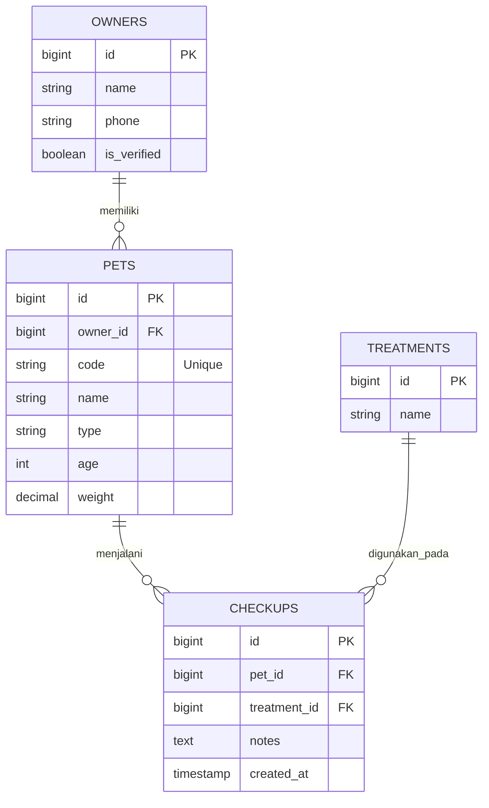

# 🏥 PetCare+ Clinic Management System

**PetCare+** adalah platform manajemen klinik hewan terpadu yang dibangun menggunakan **Laravel 11.x** dan **Bootstrap 5**. Aplikasi ini dirancang untuk menangani alur kerja harian klinik, mulai dari registrasi pemilik, manajemen hewan peliharaan, hingga rekam medis pemeriksaan (checkup).

---

## 🚀 Panduan Instalasi

Ikuti langkah-langkah berikut untuk menjalankan project di lingkungan lokal:

### 1. Persiapan Awal
Pastikan mesin Anda telah terinstall:
* PHP >= 8.2
* Composer
* MySQL atau PostgreSQL
* Node.js & NPM

### 2. Langkah-langkah Install
1.  **Clone Repositori**
    ```bash
    git clone [[https://github.com/username/petcare-plus.git](https://github.com/username/petcare-plus.git)](https://github.com/noora20FH/skill-test-arkatama-fsd.git)
    cd petcare-plus
    ```

2.  **Instal Dependensi**
    ```bash
    composer install
    npm install && npm run dev
    ```

3.  **Konfigurasi Environment**
    Salin file `.env.example` menjadi `.env`:
    ```bash
    cp .env.example .env
    ```

4.  **Setup Database (.env)**
    Buka file `.env` dan sesuaikan dengan koneksi database Anda:
    ```env
    DB_CONNECTION=mysql
    DB_HOST=127.0.0.1
    DB_PORT=3306
    DB_DATABASE=nama_database_anda
    DB_USERNAME=root
    DB_PASSWORD=
    ```

5.  **Generate Key & Migrasi**
    ```bash
    php artisan key:generate
    php artisan migrate --seed
    ```
    *Catatan: Seeder akan otomatis membuat akun Admin (`admin@petcare.com`) dan User dummy.*

6.  **Jalankan Aplikasi**
    ```bash
    php artisan serve
    ```
    Buka `http://127.0.0.1:8000` di browser Anda.

---

## 🏗️ Arsitektur Sistem & Alur Logika

Sistem ini menerapkan arsitektur yang berfokus pada efisiensi entri data dan integritas relasi antar entitas medis.
Berikut adalah visualisasi hubungan antar tabel dalam sistem PetCare+:



### 1. Struktur Database & ERD
Aplikasi ini mengelola empat entitas utama yang saling berelasi secara kompleks:
* **Owners:** Menyimpan data pemilik. Hanya pemilik dengan status `is_verified` (telepon terverifikasi) yang diizinkan untuk mendaftarkan hewan.
* **Pets:** Entitas pusat yang terhubung ke Owner melalui relasi **One-to-Many**.
* **Treatments:** Master data jenis perawatan (seperti Vaksinasi, Grooming, atau Sterilisasi).
* **Checkups:** Entitas rekam medis yang menghubungkan satu hewan dengan satu jenis perawatan (**Many-to-One**) pada waktu tertentu.

### 2. Algoritma "Smart Data Parsing"
Fitur unggulan sistem ini adalah kemampuan memproses input string tunggal menjadi data terstruktur. 
**Alur Logika:**
1.  **Input:** User memasukkan teks seperti `Milo Kucing 2Th 4.5kg`.
2.  **Regex Normalization:** Menghapus spasi ganda atau karakter liar yang tidak diinginkan.
3.  **Backward Extraction:** Sistem mengekstraksi data dari urutan paling belakang (Berat -> Usia -> Jenis) menggunakan metode `array_pop`. Hal ini dilakukan agar nama hewan (bagian depan) tetap utuh meskipun mengandung spasi (misal: "Milo Junior").
4.  **Data Cleaning:** Mengonversi satuan usia (Th, Tahun) ke integer dan satuan berat (Kg, ,) ke format float standar database.

### 3. Logika Kode Unik (Identifier)
Sistem menghasilkan kode hewan unik secara otomatis untuk setiap pendaftaran menggunakan rumus:
$$HHMM + XXXX + YYYY$$

* **HHMM**: Timestamp (Jam & Menit) saat data masuk.
* **XXXX**: ID Pemilik dengan *left-padding* 4 digit.
* **YYYY**: Sequence nomor urut hewan secara global untuk menjamin keunikan 100%.

### 4. Keamanan & Role Access Control
* **Authentication:** Menggunakan Laravel Breeze.
* **Authorization:** Menggunakan Custom Middleware `IsAdmin`.
    * **Admin Dashboard:** Memiliki akses CRUD penuh (Owners, Pets, Checkups).
    * **User Dashboard:** Hanya memiliki akses baca (Read-only) untuk melihat informasi klinik.

---

## 🛠️ Fitur Utama
* **Dashboard Statistik:** Ringkasan jumlah pasien dan rekam medis terbaru.
* **Multi-Page CRUD:** Halaman terpisah untuk manajemen Pemilik dan Hewan guna meningkatkan pengalaman pengguna (UX).
* **Medical Record History:** Setiap hewan memiliki tabel riwayat pemeriksaan yang mendetail di halaman dashboard admin.
* **Validation Layer:** Validasi ganda (Frontend & Backend) untuk memastikan tidak ada duplikasi hewan dengan nama dan jenis yang sama pada pemilik yang sama.

---

**© 2026 PetCare+ Clinic Management.** *Dibuat untuk kebutuhan Skill Test - Full Stack Developer.*

